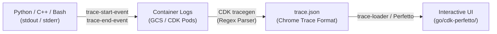
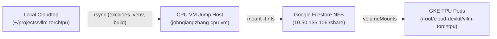

# Cloud DevKit (CDK) & Tracegen Debugging Guide

This guide details best practices for logging, instrumenting custom code (Python, C++, Bash), and analyzing Perfetto traces generated by **Cloud DevKit (CDK)** for TPU inference and training jobs.

---

## 1. CDK `tracegen` Architecture & How It Works

**`tracegen`** is Cloud DevKit's automated log-to-trace post-processor. 



1. **Emission**: Running code prints formatted timestamped events to `stdout` or `stderr`.
2. **Collection**: When a job finishes, CDK aggregates all pod logs into GCS (`gs://cloud-devkit/jobs/<JOB_ID>/logs/`).
3. **Parsing**: CDK `tracegen` scans the raw logs, matches start/end markers, pairs corresponding timestamps, and generates `trace.json` (Chrome Trace Event format).
4. **Visualization**: Traces are loaded into Perfetto at `https://trace-loader-32478767326.us-central1.run.app/<JOB_ID>` (or `go/cdk-perfetto/<JOB_ID>`).

---

## 2. Trace Instrumentation Protocol Specification

Any language or script can generate first-class Perfetto timeline slices by emitting start and end lines matching the following syntax:

```text
trace-start-event: name=<NAME> ts=<TIMESTAMP_SECONDS> pid=<PROCESS_NAME> tid=<THREAD_NAME>
trace-end-event: name=<NAME> ts=<TIMESTAMP_SECONDS> pid=<PROCESS_NAME> tid=<THREAD_NAME>
```

### Key Field Requirements:
| Field | Type | Description |
| :--- | :--- | :--- |
| **`name`** | String | Slice title displayed in the Perfetto UI. **Start and end names must match identically.** |
| **`ts`** | Float | Unix epoch timestamp in seconds with sub-millisecond precision (e.g. `1786990700.123456`). |
| **`pid`** | String | Process identifier determining the parent timeline track in Perfetto (e.g. `vllm-server`, `Worker_0`). |
| **`tid`** | String | Thread identifier determining the sub-track under the process (e.g. `main`, `compilation_thread`). |

> [!IMPORTANT]
> **Always flush stdout/stderr immediately** (`flush=True` in Python, `std::endl` in C++, or unbuffered pipes) to prevent output buffering from distorting event ordering.

---

## 3. How to Instrument Code

### A. Python Code (Context Manager & Decorator)

#### 1. Reusable Context Manager (Recommended)
```python
import contextlib
import os
import threading
import time


@contextlib.contextmanager
def cdk_trace_scope(name: str, pid: str = None, tid: str = None):
  """Context manager to trace code blocks for CDK tracegen."""
  pid_str = pid or f"Worker-{os.getpid()}"
  tid_str = tid or str(threading.get_ident())

  ts_start = time.time()
  print(
      f"cdk.trace - trace-start-event: name={name} ts={ts_start} pid={pid_str}"
      f" tid={tid_str}",
      flush=True,
  )
  try:
    yield
  finally:
    ts_end = time.time()
    print(
        f"cdk.trace - trace-end-event: name={name} ts={ts_end} pid={pid_str}"
        f" tid={tid_str}",
        flush=True,
    )


# Usage:
with cdk_trace_scope("graph_compilation_and_lowering"):
  compiled_fn = compile_fx_graph(graph, inputs)
```

#### 2. Function Decorator
```python
import functools
import os
import threading
import time


def cdk_trace(name: str = None):
  """Decorator to trace an entire function execution."""

  def decorator(func):
    event_name = name or func.__name__

    @functools.wraps(func)
    def wrapper(*args, **kwargs):
      pid_str = f"Worker-{os.getpid()}"
      tid_str = str(threading.get_ident())
      print(
          f"cdk.trace - trace-start-event: name={event_name} ts={time.time()}"
          f" pid={pid_str} tid={tid_str}",
          flush=True,
      )
      try:
        return func(*args, **kwargs)
      finally:
        print(
            f"cdk.trace - trace-end-event: name={event_name} ts={time.time()}"
            f" pid={pid_str} tid={tid_str}",
            flush=True,
        )

    return wrapper

  return decorator


# Usage:
@cdk_trace("init_model_weights")
def load_weights(model, path):
  ...
```

---

### B. Shell & Recipe (YAML) Scripts

In JobSet recipe templates (e.g. `recipe.yaml` / `values.yaml`), use `date +'%s.%N'` to emit nanosecond timestamps:

```bash
# Start event
echo "trace-start-event: name=model_download ts=$(date +'%s.%N') pid=vllm-init tid=main"

# Target operation
gcloud storage cp gs://my-bucket/models/checkpoint.bin /tmp/model/

# End event
echo "trace-end-event: name=model_download ts=$(date +'%s.%N') pid=vllm-init tid=main"
```

---

### C. C++ / Native Backend Code

#### 1. Direct Trace Event Emission
```cpp
#include <chrono>
#include <iomanip>
#include <iostream>
#include <string>

void LogCdkTraceStart(const std::string& name, const std::string& pid, const std::string& tid) {
  auto now = std::chrono::system_clock::now();
  double ts = std::chrono::duration<double>(now.time_since_epoch()).count();
  std::cerr << "cdk.trace - trace-start-event: name=" << name
            << " ts=" << std::fixed << std::setprecision(6) << ts
            << " pid=" << pid << " tid=" << tid << std::endl;
}

void LogCdkTraceEnd(const std::string& name, const std::string& pid, const std::string& tid) {
  auto now = std::chrono::system_clock::now();
  double ts = std::chrono::duration<double>(now.time_since_epoch()).count();
  std::cerr << "cdk.trace - trace-end-event: name=" << name
            << " ts=" << std::fixed << std::setprecision(6) << ts
            << " pid=" << pid << " tid=" << tid << std::endl;
}
```

#### 2. Built-in C++ Regex Patterns in `tracegen`
CDK `tracegen` automatically recognizes several standard C++ runtime and compiler log patterns:
* **XLA Compilation**:
  - Start: `Start TpuCompiler::Compile for <MODULE_NAME>`
  - Finish: `Finish TpuCompiler::Compile for <MODULE_NAME>`
  - Output Slice: `Compile:<MODULE_NAME>`
* **Device Program Scheduling**:
  - Start: `Start scheduling program <NAME> on device <DEVICE>`
  - Finish: `Finish scheduling program <NAME> on device <DEVICE>`
  - Output Slice: `Schedule:<NAME> on device <DEVICE>`
* **DMA Buffer Allocation**:
  - Pattern: `MapDmaBuffer(<BYTES>)` -> Process Track `vllm-server:mapdmabuffer`

---

## 4. Retrieving & Inspecting CDK Traces Headless

### A. Quick CLI Download
```bash
# Sync entire job output (logs, recipe, trace.json) locally:
cdk job sync-outputs <JOB_ID>

# Local files will be saved in:
# ~/cloud-devkit-data/job-outputs/<JOB_ID>/debugging/perfetto/trace.json
```

Or copy directly from GCS:
```bash
gcloud storage cp gs://cloud-devkit/jobs/<JOB_ID>/debugging/perfetto/trace.json /tmp/trace.json
```

---

### B. Python Script for Headless Trace Analysis

Run this script to summarize duration, identify longest slices, and check compilation vs DMA overhead:

```python
from collections import defaultdict
import json
import statistics

TRACE_PATH = "/tmp/trace.json"

with open(TRACE_PATH) as f:
  data = json.load(f)

events = [
    e
    for e in data
    if isinstance(e, dict) and e.get("ph") == "X" and e.get("dur", 0) > 0
]
print(f"Total Complete Slices: {len(events)}\n")

# 1. Top Longest Slices
events.sort(key=lambda x: -x["dur"])
print("=== ⏱️ Top 15 Longest Slices ===")
for e in events[:15]:
  dur_s = e["dur"] / 1e6
  print(
      f"[{e.get('ts', 0)/1e6:10.2f}s | dur {dur_s:8.2f}s] "
      f"({str(e.get('pid', ''))[:35]:35s}) -> {e.get('name')}"
  )

# 2. Per-Process Time Breakdown
print("\n=== 📊 Breakdown by Process Group ===")
proc_durs = defaultdict(float)
for e in events:
  proc_durs[str(e.get("pid", "unknown"))] += e["dur"] / 1e6

for proc, total_s in sorted(proc_durs.items(), key=lambda x: -x[1])[:10]:
  print(f"{proc:50s} : {total_s:8.2f} s")
```

---

## 5. Perfetto UI Tips for CDK Traces

* **Zoom / Pan**: Use **`W` / `S`** to zoom in/out, **`A` / `D`** to pan horizontally.
* **Quick Search**: Press **`Ctrl + F`** or **`/`** to find key slices (`compile_or_warm_up_model`, `_dummy_run`, `step-3`, `MapDmaBuffer`).
* **Filtering Noise**: If `MapDmaBuffer` tracks crowd the top of the timeline, collapse the `mapdmabuffer` process track to focus on `VllmWorker` and device execution tracks.
* **SQL Querying**: Open **Query (SQL)** on the left drawer:
  ```sql
  SELECT 
      name, 
      ROUND(dur / 1e9, 3) AS duration_sec, 
      ROUND(ts / 1e9, 3) AS start_sec
  FROM slice
  WHERE name LIKE '%compile%' OR name LIKE '%warmup%'
  ORDER BY duration_sec DESC;
  ```

---

## 6. Common Troubleshooting Patterns

| Symptom | Probable Cause | Action |
| :--- | :--- | :--- |
| **Slice missing from Perfetto** | Output buffering delayed or swallowed print lines | Add `flush=True` to Python `print()` or use `std::endl` in C++. |
| **Slice duration is 0 or corrupted** | Start and end `name` strings differ (e.g. dynamic parameters) | Ensure `name` in `trace-start-event` and `trace-end-event` is 100% identical. |
| **Trace UI flooded by thousands of slices** | High-frequency logging in inner loop (e.g. per-token DMA) | Move trace points outside tight iteration loops or trace step batches. |
| **Job finished but `trace.json` not generated** | Container crashed before log archive or syntax error in logs | Check `cdk job log <JOB_ID>` and verify log archive phase completed in `cdk job desc <JOB_ID>`. |

---

## 7. Fast Iteration via Filestore NFS (Zero-Rebuild Hot Reloading)

Prebuilt CDK Docker images (`vllm-torchtpu`, `vllm-torchax`) install packages in editable mode (`pip install -e /root/cloud-devkit/<repo>`). Mounting your working copy from Filestore NFS allows containers to run your latest edits instantly without rebuilding Docker images.

### A. Architecture Overview



---

### B. One-Time Setup on CPU VM (Jump Host)

Because Filestore uses internal VPC IPs (e.g. `10.50.136.106`), initialize your personal workspace via a CPU VM in the same VPC:

1. **Install dependencies on CPU VM**:
   ```bash
   sudo apt-get update && sudo apt-get install -y rsync nfs-common
   ```

2. **Mount NFS and create user workspace**:
   ```bash
   sudo mkdir -p /mnt/share
   sudo mount -t nfs 10.50.136.106:/share /mnt/share
   sudo mkdir -p /mnt/share/workspaces/<username>/vllm-torchtpu \
                 /mnt/share/workspaces/<username>/vllm-torchtpu-cache
   sudo chown -R $(whoami):$(whoami) /mnt/share/workspaces/<username>/
   ```

3. **SSH alias in `~/.ssh/config` (on Cloudtop)**:
   ```ssh
   Host <username>-cpu-vm
       HostName <EXTERNAL_IP>
       User <username>_google_com
       IdentityFile ~/.ssh/google_compute_engine
       IdentitiesOnly yes
       StrictHostKeyChecking no
       UserKnownHostsFile /dev/null
   ```

---

### C. Daily Code Sync Command (from Cloudtop)

Run this high-speed `rsync` from Cloudtop whenever you make local code changes (skips large `.venv` environments, caches, and git metadata for 1-second syncs):

```bash
rsync -avz \
  --exclude '.venv' \
  --exclude '__pycache__' \
  --exclude '*.pyc' \
  --exclude '.git' \
  --exclude '*.egg-info' \
  --exclude 'build' \
  --exclude 'dist' \
  ~/projects/vllm-torchtpu/ \
  <username>-cpu-vm:/mnt/share/workspaces/<username>/vllm-torchtpu/
```

---

### D. JobSet Recipe YAML Configuration

Map your NFS workspace and isolated compilation cache directory into the container:

```yaml
volumeMounts:
  - name: vllm-torchtpu-<username>
    mountPath: /root/cloud-devkit/vllm-torchtpu/
  - name: xla-cache
    mountPath: /root/vllm-torchtpu-cache/

volumes:
  - name: vllm-torchtpu-<username>
    nfs:
      server: 10.50.136.106
      path: /share/workspaces/<username>/vllm-torchtpu/
  - name: xla-cache
    nfs:
      server: 10.50.136.106
      path: /share/workspaces/<username>/vllm-torchtpu-cache/
```

> [!TIP]
> Always maintain an isolated `xla-cache` subfolder per user (e.g. `/share/workspaces/<username>/vllm-torchtpu-cache/`) to prevent compilation cache collisions across developers.

