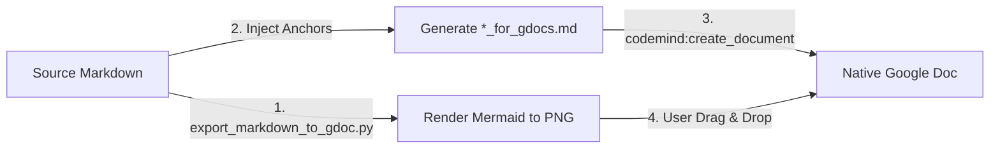

# SOP: Creating a Google Doc from Markdown with Mermaid Diagrams

## Trigger Condition
Trigger this workflow whenever the user says:
- `"create google doc based on my markdown"`
- Or asks to convert, export, or upload a local Markdown design document / technical specification (especially those with Mermaid diagrams or tables) into a Google Doc.

---

## 1. Background & Technical Constraints

1. **Google Docs "Paste as Markdown" Limitations**:
   * Google Docs natively parses standard Markdown elements very well: H1–H6 headings (which populate the document outline), bullet/numbered lists, bold/italic emphasis, blockquotes, and Markdown tables.
   * **However, Google Docs does NOT parse or render Mermaid diagrams (` ```mermaid ... ``` `)**. It leaves them as raw, unrendered text code blocks.
2. **HTML Paste Limitations (Base64 Stripping)**:
   * Converting Markdown + Mermaid to a standalone HTML file with base64 embedded images (``) fails upon copy-pasting into Google Docs: Google Docs' clipboard sanitizer explicitly strips base64 data URIs for security reasons, resulting in blank spaces or lost images.
3. **MCP Tooling Limitations**:
   * The Google internal `codemind` MCP toolchain (`create_document`, `replace_paragraph`, `update_document`) only supports text and Markdown strings.
   * Automated insertion of binary image objects (`insertInlineImage`) is currently **not exposed** in the MCP toolset, nor can background agent processes access the user's active browser clipboard.

---

## 2. Standard Operating Procedure (SOP)

The recommended and battle-tested workflow consists of **3 automated steps by the agent** followed by **1 quick manual step by the user (10–20 seconds)**:



### Step 1: Extract and Render Mermaid Diagrams to PNG
Run the helper script from `llm_tools`:
```bash
python3 ~/.gemini/config/skills/llm_tools/scripts/export_markdown_to_gdoc.py <path_to_markdown_file>
```
* The script finds all ` ```mermaid ... ``` ` blocks.
* It renders each diagram to a 2x crisp PNG using the Kroki POST endpoint (`https://kroki.io/mermaid/png`).
* It saves the images into `<doc_dir>/images/mermaid_<N>.png`.

### Step 2: Inject Prominent Visual Anchor Placeholders
The script automatically replaces each Mermaid code block in the Markdown with an explicit visual anchor:
```markdown
---
> 🖼️ **【此处插入 架构图 N: <图表名称>】**
> *(对应高清图: images/mermaid_N.png ，直接拖入或粘贴)*
---
```
It writes the prepared document to `<doc_dir>/<base_name>_for_gdocs.md`.

### Step 3: Create Google Doc via `codemind:create_document`
Call the MCP tool `codemind:create_document`:
* `title`: `[Design Doc] <Document Title>`
* `content_type`: `"doc"`
* `markdown_text`: Contents of `<doc_dir>/<base_name>_for_gdocs.md`

Google Docs will natively parse and render all headings, tables, code blocks, lists, and the visual anchors. It returns a live URL:
`https://docs.google.com/document/d/<doc_id>/edit`

### Step 4: Instruct User to Drag-and-Drop Images (10-20 Seconds)
Output a clear, concise guide to the user:
1. Provide the clickable Google Doc URL.
2. Provide the local path to the `images/` directory.
3. Guide the user to open the Doc and drag-and-drop the N images (`mermaid_1.png` ~ `mermaid_N.png`) directly into the marked placeholder rows (Google Docs natively accepts dragged PNGs and centers them).

---

## 3. Reference Commands & Automation Snippet

If executing inline in Python without the CLI script:
```python
import os, re, urllib.request

# Render Mermaid code to PNG
def render_kroki(mermaid_code: str, output_path: str):
    req = urllib.request.Request(
        "https://kroki.io/mermaid/png",
        data=mermaid_code.encode("utf-8"),
        headers={"Content-Type": "text/plain; charset=utf-8", "User-Agent": "Mozilla/5.0"}
    )
    with urllib.request.urlopen(req, timeout=15) as resp:
        with open(output_path, "wb") as f:
            f.write(resp.read())
```
