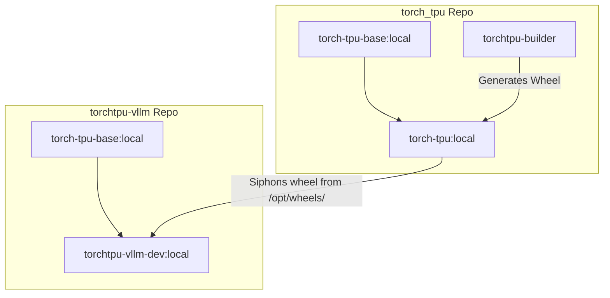

# Building Developer Docker Images from Local Source

This guide explains how to build the Docker development environment locally from the source repositories of `torch_tpu` and `torchtpu-vllm` using the automated build coordinator.

---

## 🏗️ Docker Build Architecture

The build coordinator compiles and links the entire stack locally while keeping uncommitted source files isolated:

1. **`torch-tpu-base:local`**: Contains Python 3.12 and heavy, slow dependencies. Built from local `torch_tpu` dockerfiles.
2. **`torch-tpu:local`**: Compiles the C++ core and packages the `torch_tpu` library into a local wheel.
3. **`torchtpu-vllm-dev:local`**: Siphons the compiled wheel from `torch-tpu:local`, mounts your local `torchtpu-vllm` repository, and installs it in **editable mode** (`-e ".[test,benchmarking]"`).



---

## 🚀 Building with the Coordinator Script

You can build both repositories sequentially in a single command using the automated coordinator script:
[`build_dev_docker.sh`](file:///usr/local/google/home/johnqiangzhang/projects/llm_skills/skills/torch_vllm_development/scripts/build_dev_docker.sh)

### Basic Usage:
```bash
./projects/llm_skills/skills/torch_vllm_development/scripts/build_dev_docker.sh
```
* **No Arguments:** Resolves automatically to the default source paths `~/projects/torch_tpu` and `~/projects/torchtpu-vllm`, and outputs the final image tagged as `torchtpu-vllm-dev:local`.

### Advanced Usage (Custom Paths & Tags):
To override the default paths or tag suffix, pass them as arguments:
```bash
./projects/llm_skills/skills/torch_vllm_development/scripts/build_dev_docker.sh [path/to/torch_tpu] [path/to/torchtpu-vllm] [image_tag]
```
Example:
```bash
./projects/llm_skills/skills/torch_vllm_development/scripts/build_dev_docker.sh ~/projects/torch_tpu ~/projects/torchtpu-vllm my-custom-tag:local
```

---

## ☸️ Deploying Local Developer Images to GKE

Yes, you can deploy these locally-built images containing your modifications directly to GKE.

### 📋 Workflow Steps

1. **Authenticate with Google Artifact Registry:**
   Configure Docker to authenticate with your GCP registry location:
   ```bash
   gcloud auth configure-docker us-central1-docker.pkg.dev
   ```

2. **Build and Push with a Single Command:**
   Run the coordinator script with your target GKE registry tag and pass the `--push` flag:
   ```bash
   export REGISTRY="us-central1-docker.pkg.dev/tpu-prod-env-one-vm/vllm-tpu-repo"
   
   ./projects/llm_skills/skills/torch_vllm_development/scripts/build_dev_docker.sh \
     --torch-tpu-dir ~/projects/torch_tpu \
     --torchtpu-vllm-dir ~/projects/torchtpu-vllm \
     --image-tag ${REGISTRY}/torchtpu-vllm-dev:local \
     --push
   ```


3. **Deploy the Pod Manifest to GKE:**
   Configure your GKE Pod deployment manifest (e.g. `torchtpu-vllm-dev-pod.yaml`) to pull the tagged developer image:
   ```yaml
   spec:
     containers:
     - name: vllm-tpu-dev
       image: us-central1-docker.pkg.dev/tpu-prod-env-one-vm/vllm-tpu-repo/torchtpu-vllm-dev:local
       imagePullPolicy: Always
       command: ["sleep", "infinity"]
   ```
   Apply it using kubectl:
   ```bash
   kubectl apply -f torchtpu-vllm-dev-pod.yaml
   ```


